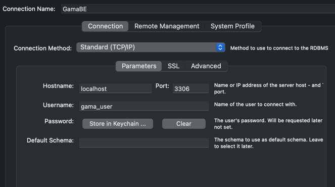

docker-compose build

docker-compose up -d

docker exec -it gama_php bash 

composer install

php artisan migrate

php artisan db:seed

php artisan key:generate

open mysql workbench with similar below config 

username and password: gama_user

import db from file GamaBE.sql -->
